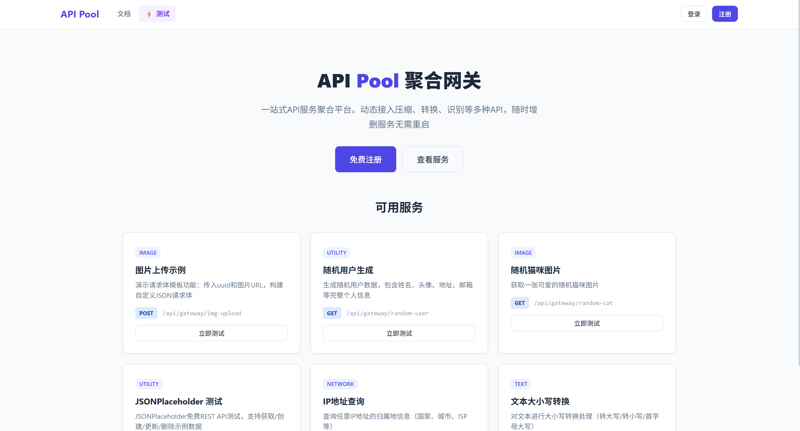
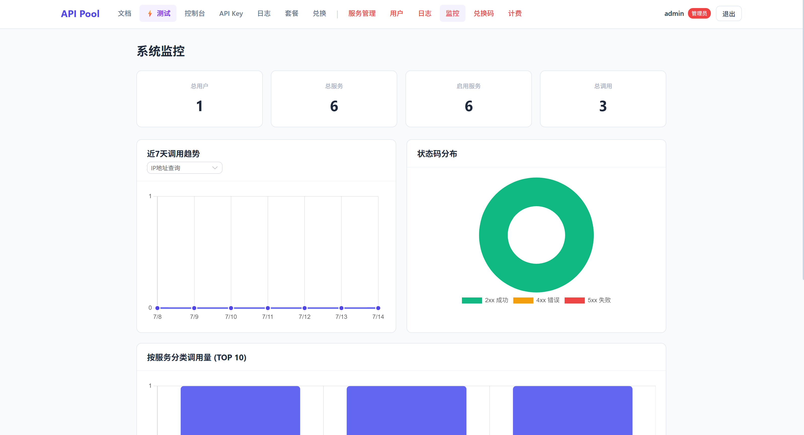
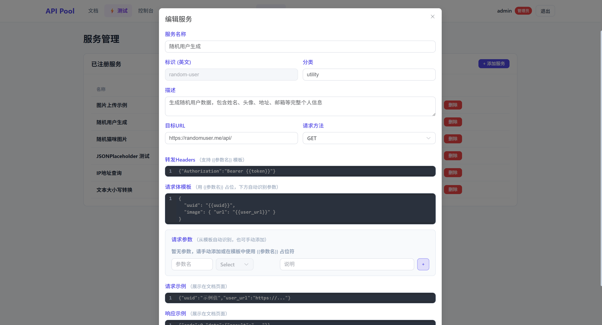

# API Pool Gateway

[English](README.md) | [中文](README-zh_CN.md)

A dynamic API aggregation gateway platform. Register multiple third-party API services (compression, data conversion, image recognition, etc.) into a unified gateway and call them through a single API Key — no need to know the underlying service endpoints. Services can be added or removed without restarting the server.

### Features

- **Dynamic Service Registration** — Add, update, or remove API services at runtime without server restart
- **Unified API Key** — One key to access all registered services
- **Smart Rate Limiting** — Configurable rate limits per billing tier (requests/second and requests/day)
- **Billing System** — Four tiers: Free, Basic, Pro, Enterprise
- **Redeem Codes** — Generate and redeem codes for quota top-ups
- **Audit Logging** — Full audit trail for all admin operations and API calls
- **Admin Panel** — Web UI for managing services, users, billing, and monitoring
- **API Playground** — Built-in testing tool for registered services

### Screenshots

| Dashboard | Services Management | API Test |
| :--- | :--- | :--- |
|  |  |  |

### Tech Stack

| Layer    | Technology                                          |
| -------- | --------------------------------------------------- |
| Backend  | Node.js + Express 4                                 |
| Database | nedb (embedded file-based NoSQL)                    |
| Frontend | Vue 3 + Vite + Element Plus + Pinia                 |
| Auth     | JWT (Bearer) + API Key                              |

### Quick Start (Docker)

The image comes with pre-built frontend in `public/` — no build step needed.

```bash
git clone https://github.com/jiuchai/Api-Pool-Gateway.git
cd Api-Pool-Gateway
cp .env.example .env          # Edit .env with your settings

docker-compose up -d
# Open http://localhost:8080 (Nginx)
```

> The app is accessed through Nginx reverse proxy on port `8080` by default. Both the web UI and all API endpoints are served through this single port — no need to expose the app port directly.

All environment variables are read from the `.env` file automatically.

> To access upstream services running on the host machine (e.g., `127.0.0.1:1001`) from inside the Docker container, use `host.docker.internal` instead of `127.0.0.1`, e.g., `http://host.docker.internal:1001`. The `extra_hosts` is already configured in `docker-compose.yml`.

#### Rebuilding Frontend

If you modified the frontend and want to rebuild it inside Docker, set `BUILD_FRONTEND=true` in `.env` and rebuild:

```bash
BUILD_FRONTEND=true docker-compose up -d --build
```

#### Development (Hot-Reload)

```bash
# Prerequisites: Node.js >= 18, npm >= 9
npm install && cd frontend && npm install && cd ..
npm run dev:all
# Backend → http://localhost:3000
# Frontend dev server → http://localhost:5174
```

#### Default Admin Account

| Field    | Value           |
| -------- | --------------- |
| Username | admin           |
| Email    | admin@pool.com  |
| Password | Admin@123456    |

> Change these values in `.env` before deploying to production.

### Environment Variables

| Variable        | Description            | Default              |
| --------------- | ---------------------- | -------------------- |
| `PORT`            | App internal port                              | `3000`               |
| `JWT_SECRET`      | JWT signing secret                            | (required)           |
| `ADMIN_USERNAME`  | Admin account username                        | `admin`              |
| `ADMIN_EMAIL`     | Admin account email                           | `admin@pool.com`     |
| `ADMIN_PASSWORD`  | Admin account password                        | `Admin@123456`       |
| `NGINX_PORT`      | Nginx public port (web UI + API)              | `8080`               |
| `BUILD_FRONTEND`  | Rebuild frontend from source in Docker        | `false`              |

### Project Structure

```
├── server.js           # Backend entry point
├── config/             # Configuration (port, JWT, billing tiers, rate limits)
├── database/           # nedb database setup
├── middleware/          # Auth, logger, rate limiter
├── routes/             # Express route handlers
│   ├── admin.js        # Admin panel API
│   ├── gateway.js      # Core: dynamic service proxy
│   ├── auth.js         # Authentication
│   ├── apikeys.js      # API key management
│   ├── billing.js      # Billing & plans
│   ├── logs.js         # Call logs
│   └── redeem.js       # Redeem codes
├── services/           # Business logic layer
├── utils/              # Utility functions
├── frontend/           # Vue 3 frontend
│   ├── src/
│   │   ├── views/      # Page components
│   │   ├── components/ # Shared components
│   │   ├── stores/     # Pinia stores
│   │   ├── router/     # Vue Router
│   │   └── api/        # Axios client
│   └── package.json
├── nginx/              # Nginx reverse proxy config
├── image/              # Screenshots
├── skills.md           # AI Agent skill documentation
└── data/               # nedb database files (auto-created)
```

### AI Agent Integration

The gateway provides tools for AI agents to discover and call registered services programmatically.

#### Tools API

| Endpoint | Method | Description |
| -------- | ------ | ----------- |
| `/api/gateway/tools` | GET | Get all available tools (no auth required) |
| `/api/gateway/:slug/info` | GET | Get detailed info for a specific tool |
| `/api/gateway/:slug` | POST | Call a tool (requires API Key) |

#### Skills Definition

See [skills.md](skills.md) for the complete AI agent skill documentation, including usage workflow, authentication, and API schemas.

### License

MIT

---

[中文文档](README-zh_CN.md)
